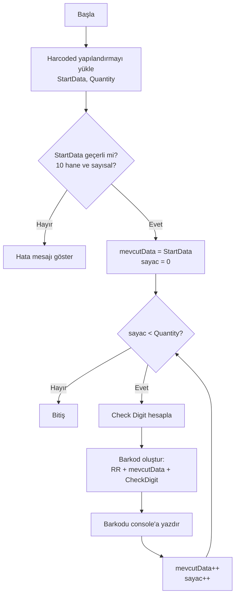
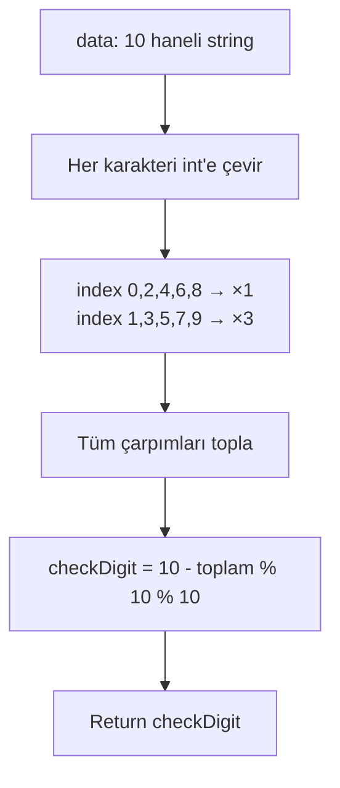

# PTT Barkod Üretici - C# .NET 8 Console Application Planı

## 1. Gereksinimler

### 1.1 Amaç
Verilen başlangıç barkod numarasından itibaren, belirtilen adet kadar PTT kargo barkod numarası üreten bir C# .NET 8 konsol uygulaması.

### 1.2 Barkod Formatı
- **Format:** `RR` + 10 hane veri + 1 hane kontrol basamağı = **13 karakter**
- **Örnek:** `RR06085766138`
  - `RR` → Sabit ön ek (registered mail)
  - `0608576613` → 10 haneli veri
  - `8` → Kontrol basamağı (check digit)

### 1.3 Kontrol Basamağı Hesaplama Algoritması
1. 10 haneli verinin her bir basamağı sırayla 1 ve 3 ile çarpılır (1. basamak ×1, 2. basamak ×3, 3. basamak ×1, ...)
2. Tüm çarpımlar toplanır
3. Kontrol basamağı = (10 - (toplam % 10)) % 10
4. Eğer toplam 10'un katı ise kontrol basamağı 0'dır

**Doğrulama (örnek veri: 0608576613):**
| Basamak | 0 | 6 | 0 | 8 | 5 | 7 | 6 | 6 | 1 | 3 |
|---------|---|---|---|---|---|---|---|---|---|---|
| Çarpan | 1 | 3 | 1 | 3 | 1 | 3 | 1 | 3 | 1 | 3 |
| Çarpım | 0 | 18 | 0 | 24 | 5 | 21 | 6 | 18 | 1 | 9 |
- Toplam: 102
- Kontrol basamağı: (10 - 102%10) % 10 = (10 - 2) % 10 = **8**
- Sonuç: `RR06085766138` ✅

### 1.4 Yapılandırma (Hardcoded)
- **Başlangıç Verisi** (`startData`): 10 haneli başlangıç numarası (örn: `0608576613`)
- **Adet** (`quantity`): Üretilecek barkod sayısı (örn: `10`)

## 2. Proje Yapısı

```
e:/_CODE_/PttBarkodGenerator/
├── PttBarkodGenerator.csproj    # .NET 8 console app proje dosyası
├── Program.cs                   # Ana giriş noktası
├── Services/
│   └── BarcodeGenerator.cs      # Barkod üretme mantığı
├── Models/
│   └── BarcodeConfig.cs         # Yapılandırma modeli
└── README.md                    # Kullanım talimatları (opsiyonel)
```

## 3. Sınıf / Modül Tasarımı

### 3.1 `Models/BarcodeConfig.cs`
```csharp
public class BarcodeConfig
{
    public string Prefix { get; set; } = "RR";
    public string StartData { get; set; }    // 10 haneli başlangıç verisi
    public int Quantity { get; set; }        // Üretilecek adet
}
```

### 3.2 `Services/BarcodeGenerator.cs`
- `bool ValidateData(string data)` → 10 hane kontrolü
- `int CalculateCheckDigit(string data)` → Algoritma ile check digit hesaplama
- `string GenerateSingle(string data)` → Tek barkod (RR + data + check digit) üretme
- `List<string> GenerateBatch(string startData, int quantity)` → Toplu üretim

### 3.3 `Program.cs`
- Yapılandırmayı tanımla (hardcoded)
- Barkodları üret
- Console'a yazdır

## 4. Akış Diyagramı



## 5. Kontrol Basamağı Hesaplama Akışı



## 6. Çıktı Örneği

```
=======================================
  PTT Barkod Üretici
=======================================
Başlangıç:  0608576613
Adet:       4
=======================================

RR06085766138
RR06085766145
RR06085766152
RR06085766169

=======================================
  Tamamlandı - 4 barkod üretildi.
=======================================
```

## 7. Yapılacaklar (Todo)

Aşağıdaki todo listesi, uygulamanın adım adım geliştirilmesi için hazırlanmıştır.
